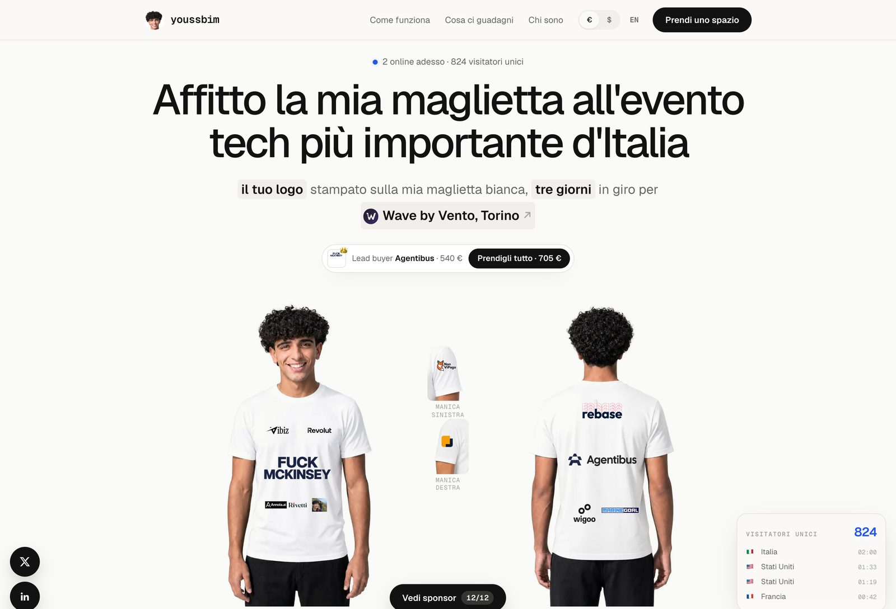

# Sponsor My Tee

Sell print spots on a t-shirt you'll wear at a conference, as a live auction. People bid on a spot, pay by card, and the highest bid on each spot gets printed. Outbid someone and they get refunded automatically.

Built with Next.js, Supabase and Stripe. Everything in this repo is placeholder content — photos, event, copy — so you can point it at your own event in about an hour.



*The site in production at [itechweek.youssbim.com](https://itechweek.youssbim.com), the project this template comes from. This repo ships with placeholder photos and copy instead.*

## What it does

- **Twelve print spots** on the front, sleeves and back, each with its own size, opening price and description.
- **Live auction.** To take a spot from someone you must beat them by 30% (at least €10 more), rounded up to a multiple of 5. Every rule is enforced in the database too, so two people paying at the same second can't both win.
- **Full payment up front** through Stripe Checkout. When someone outbids you, your money goes back automatically.
- **Lead buyer takeover.** The brand that has spent the most is shown at the top, and anyone can take *all* of its spots in a single payment.
- **Logo preview** on the tee before paying, and a live wall of sponsors.
- **Admin at `/adm`**: approve or reject logos, add sponsors who paid outside Stripe, resize and move each logo inside its spot, edit the fundraising goal, retry refunds.
- **Two languages** (English and Italian) with automatic redirect by visitor country, plus a currency toggle.
- **Visitor counter** and a live feed of visits and bids.

## Quick start

```bash
pnpm install
cp .env.example .env.local     # you can leave it empty to start
pnpm dev
```

With no keys at all the site runs in **demo mode**: bids are stored in a local JSON file (`.data/dev-store.json`) and checkout is a fake page, so you can click through the whole flow. The admin password in demo mode is `admin`.

## Going live

### 1. Database (Supabase)

1. Create a project on [supabase.com](https://supabase.com).
2. Link it and push the schema:
   ```bash
   npx supabase link --project-ref YOUR_PROJECT_REF
   npx supabase db push
   ```
   This creates the `bids`, `badge_claims`, `visits` and `site_stats` tables, the logo storage bucket, and the functions that decide who is leading.
3. Copy the project URL, the publishable key and the **secret** key into your env.

### 2. Payments (Stripe)

1. Get your API keys from the Stripe dashboard.
2. Add a webhook endpoint pointing to `https://yourdomain.com/api/stripe/webhook` with these events:
   `checkout.session.completed`, `checkout.session.expired`, `checkout.session.async_payment_succeeded`, `checkout.session.async_payment_failed`.
3. Copy the signing secret into `STRIPE_WEBHOOK_SECRET`.

Discount codes work out of the box: create a coupon and a promotion code in Stripe and buyers can type it at checkout, 100% coupons included.

### 3. Environment

| Variable | What it is |
| --- | --- |
| `NEXT_PUBLIC_SITE_URL` | Your public URL, e.g. `https://tee.example.com` |
| `NEXT_PUBLIC_SUPABASE_URL` | Supabase project URL |
| `NEXT_PUBLIC_SUPABASE_PUBLISHABLE_KEY` | Supabase publishable key (safe in the browser) |
| `SUPABASE_SECRET_KEY` | Supabase secret key (server only) |
| `STRIPE_SECRET_KEY` | Stripe secret key |
| `STRIPE_WEBHOOK_SECRET` | Stripe webhook signing secret |
| `ADMIN_PASSWORD` | Password for `/adm` |
| `NEXT_PUBLIC_CONTACT_EMAIL` | Shown in the footer and the legal pages |
| `RESEND_API_KEY`, `RESEND_FROM`, `ADMIN_EMAIL` | Optional: emails to bidders and to you |

Bidding only opens when both the database and payments are configured, so a half-finished deploy can't take money.

### 4. Deploy

Any Next.js host works. On Vercel: import the repo, add the variables above for Production, deploy.

## Make it yours

| What | Where |
| --- | --- |
| Site name, your links, event name and dates, auction close date, goal | `lib/config.ts` |
| The twelve spots: sizes in cm, opening prices, names, descriptions | `lib/spots.ts` |
| Where each spot sits on the photos | `lib/tee-photo.ts` |
| Event numbers, speakers, sources | `lib/event-stats.ts` |
| All the copy, English and Italian | `lib/i18n/en.ts`, `lib/i18n/it.ts` |
| Colours and fonts | `app/globals.css` |
| Terms and privacy | `components/legal-page.tsx` |

### Your own photos

Replace the placeholders in `public/tee/`:

- `front.jpg` and `back.jpg` — you wearing the plain tee, 1024 × 1420, white background.
- `sleeve-left.jpg` and `sleeve-right.jpg` — close-ups of each sleeve, 560 × 747.
- `public/avatar.jpg` — your face, square.

Then adjust the rectangles in `lib/tee-photo.ts`: each one is `{ x, y, w, h }` in percent of the photo. Open the site, hover a spot and nudge the numbers until the outline sits on the fabric where the print will go.

### The auction rules

In `lib/config.ts`:

```ts
auction: {
  closesAt: "2026-10-01T20:00:00+02:00",
  minIncrement: 10,   // never less than this on top
  raiseRate: 0.3,     // 30% above the current bid
  roundTo: 5,         // rounded up to a multiple of 5
  goal: 1500,         // also editable from /adm
}
```

The same rule lives in the database (`supabase/migrations`), so if you change the rate here, update the default in the latest `confirm_bid` migration too.

## How the money flows

1. Someone bids: a row is created as `pending` and a Stripe Checkout opens.
2. They pay. Stripe calls the webhook; the site also asks Stripe directly when the buyer comes back, so a missed webhook never leaves a paid bid stuck.
3. The database confirms the bid under a per-spot lock: either it leads, or it arrived too late and is refunded.
4. The previous holder is marked outbid and refunded in full. If several spots were bought in one payment, only the lost spot's share is refunded.
5. When bidding closes, nothing else is owed: the winning bid is the whole price.

## Admin

Go to `/adm` and sign in with `ADMIN_PASSWORD`.

- **Spots**: set a sponsor by hand (for someone who paid you off-site), replace or free a spot, resize and move each logo inside its print area with a live preview.
- **Review queue**: approve logos before they show up publicly, or reject and refund.
- **Goal**: edit the fundraising target shown in the hero.
- **All bids**: newest first, with refunds and Stripe status.

## Notes

- Payments are charged in euros; the currency toggle is a display-only conversion.
- Visits are stored as country + timestamp only, no IP.
- The tee photos in this repo are drawings, not a real person. Use your own.

## License

MIT — see [LICENSE](LICENSE). Have fun, and tell me if you actually wear it.
